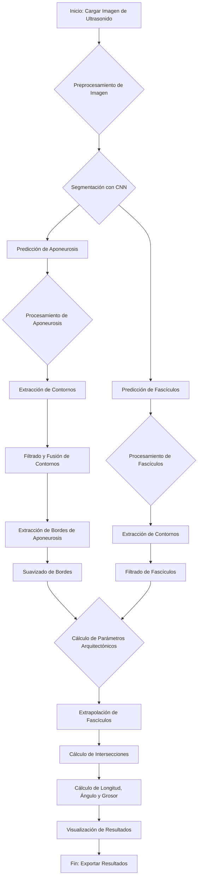

# Descripción y Diagrama de Flujo del Módulo de Análisis de Imágenes Estáticas en DL_Track_US

Este documento detalla el funcionamiento del programa `DL_Track_US` para el análisis automático de imágenes estáticas de ultrasonido muscular. A continuación, se presenta un diagrama de flujo que resume el proceso, seguido de una explicación detallada de cada etapa.

## Diagrama de Flujo del Análisis Automático

## Explicación Detallada del Proceso

El análisis automático de imágenes estáticas en `DL_Track_US` sigue un pipeline robusto que combina técnicas de Deep Learning y procesamiento de imágenes clásico. A continuación se describe cada paso:

1.  **Carga y Preprocesamiento de la Imagen**:
    *   El usuario selecciona una imagen de ultrasonido desde la interfaz gráfica.
    *   La imagen se carga en memoria y se preprocesa para que sea compatible con los modelos de redes neuronales convolucionales (CNN). Esto incluye:
        *   **Normalización**: Los valores de los píxeles se escalan a un rango específico (generalmente \[0, 1]).
        *   **Redimensionamiento**: La imagen se redimensiona a las dimensiones de entrada que esperan los modelos (e.g., 512x512 píxeles).

2.  **Segmentación con Redes Neuronales Convolucionales (CNN)**:
    *   La imagen preprocesada se introduce en dos modelos de CNN pre-entrenados:
        *   **`model_apo`**: Especializado en detectar y segmentar las **aponeurosis** (las membranas de tejido conectivo que envuelven los músculos).
        *   **`model_fasc`**: Especializado en detectar y segmentar los **fascículos** musculares.
    *   La salida de cada modelo es una máscara de probabilidad, donde cada píxel tiene un valor que indica la probabilidad de pertenecer a la estructura de interés (aponeurosis o fascículo).

3.  **Procesamiento de las Predicciones**:
    *   **Binarización**: Las máscaras de probabilidad se convierten en máscaras binarias aplicando un umbral. Los píxeles con una probabilidad superior al umbral se asignan a la clase (valor 1 o 255) y el resto al fondo (valor 0).
    *   **Extracción de Contornos**: Se utiliza el algoritmo de `cv2.findContours` para identificar los contornos de las regiones segmentadas en las máscaras binarias.

4.  **Refinamiento de Aponeurosis**:
    *   **Filtrado por Longitud**: Se eliminan los contornos pequeños que probablemente son ruido (`apo_length_tresh`).
    *   **Ordenamiento**: Los contornos de las aponeurosis se ordenan verticalmente para identificar cuál es la superficial (arriba) y cuál la profunda (abajo).
    *   **Fusión de Contornos**: Se implementa una lógica para fusionar contornos que están cerca y alineados, con el fin de reconstruir aponeurosis que puedan haber sido segmentadas en fragmentos.
    *   **Esqueletización y Operaciones Morfológicas**: Para asegurar una línea continua, se aplica `skeletonize` seguido de dilatación y erosión, lo que ayuda a cerrar pequeños huecos.
    *   **Extracción de Bordes**: De la aponeurosis superficial se extrae el borde inferior, y de la profunda, el borde superior. Estos son los bordes que están en contacto con los fascículos.
    *   **Suavizado**: Los bordes extraídos, que pueden ser irregulares, se suavizan utilizando un filtro de Savitzky-Golay (`savgol_filter`) para obtener una curva más realista.

5.  **Refinamiento de Fascículos**:
    *   **Filtrado por Longitud**: Se descartan los contornos de fascículos que son demasiado cortos (`fasc_cont_thresh`), ya que no son fiables para el análisis.
    *   **Enmascaramiento**: Solo se consideran los fascículos que se encuentran dentro de la región de interés (ROI) definida por las dos aponeurosis.

6.  **Cálculo de Parámetros Arquitectónicos**:
    *   **Modelado Lineal y Extrapolación**:
        *   Cada fascículo y los bordes de las aponeurosis se modelan como líneas (polinomios de grado 1).
        *   Estas líneas se extrapolan para asegurar que se crucen.
    *   **Cálculo de Intersecciones**: Se encuentran los puntos de intersección entre cada fascículo extrapolado y las dos aponeurosis.
    *   **Cálculo de Parámetros**:
        *   **Longitud del Fascículo (FL)**: Se calcula la distancia euclidiana entre los dos puntos de intersección de un fascículo con las aponeurosis.
        *   **Ángulo de Pennación (PA)**: Se calcula como el ángulo entre el fascículo y la aponeurosis profunda.
        *   **Grosor Muscular (MT)**: Se mide como la distancia perpendicular entre las dos aponeurosis en la región central de la imagen.
    *   **Filtrado por Ángulo**: Se descartan los fascículos cuyo ángulo de pennación cae fuera de un rango predefinido (`min_pennation`, `max_pennation`), considerándolos como detecciones erróneas.

7.  **Visualización y Exportación**:
    *   Se genera una figura (`matplotlib.figure`) que muestra la imagen original con las aponeurosis y los fascículos detectados superpuestos.
    *   Los resultados numéricos (FL, PA, MT) se devuelven como listas y valores flotantes, y se pueden exportar a formatos como CSV.

---

# Comparación: `doCalculations` vs. `doCalculations_custom`

Para permitir un análisis más avanzado y una mayor flexibilidad, se creó la función `doCalculations_custom` como una extensión de la función original `doCalculations`. A continuación, se detallan las diferencias clave.

## `doCalculations` (Función Original)

*   **Propósito**: Es la función principal para el análisis automático de imágenes estáticas. Su objetivo es calcular y devolver los parámetros arquitectónicos básicos y una visualización.
*   **Salidas Principales**:
    1.  `fasc_l`: Lista de longitudes de fascículos.
    2.  `pennation`: Lista de ángulos de pennación.
    3.  `x_low`: Coordenadas X de inserción en la aponeurosis profunda.
    4.  `x_high`: Coordenadas X de inserción en la aponeurosis superficial.
    5.  `midthick`: Grosor muscular.
    6.  `fig`: Figura de Matplotlib con la visualización.

## `doCalculations_custom` (Función Modificada)

*   **Propósito**: Extiende la funcionalidad de `doCalculations` para proporcionar datos más detallados sobre las estructuras segmentadas, permitiendo análisis más complejos y una mejor depuración visual.
*   **Salidas Adicionales**: Además de todas las salidas de la función original, `doCalculations_custom` devuelve:
    1.  **`mask_roi`**: Una máscara binaria (NumPy array) que representa la **Región de Interés (ROI)**, es decir, el área exacta del músculo delimitada por las aponeurosis. Esto es útil para análisis posteriores que necesiten aislar el tejido muscular.
    2.  **`aponeurosis_sup`**: Una lista que contiene las coordenadas X (`upp_x_apo`), las coordenadas Y suavizadas (`upp_y_apo`) y el número total de puntos (`len(upp_x_apo)`) de la aponeurosis superficial.
    3.  **`aponeurosis_inf`**: Similar a la anterior, pero para la aponeurosis profunda (`low_x_apo`, `low_y_apo`, `len(low_x_apo)`).

*   **Cambios en la Visualización**:
    *   **Colores Diferenciados**: Las aponeurosis se dibujan con colores distintos (azul para la superficial, verde oscuro para la profunda) para una mejor identificación.
    *   **Superposición de ROI**: La máscara `mask_roi` se superpone en la gráfica con un color semitransparente (púrpura), mostrando claramente el área muscular analizada.
    *   **Leyenda Mejorada**: La leyenda de la gráfica se actualiza para reflejar los nuevos elementos visuales.

*   **Mejoras en el Código**:
    *   **Creación de la Máscara ROI**: Se modificó la lógica para generar una máscara ROI más precisa, utilizando interpolación polinómica para rellenar el área entre las aponeurosis, incluso si sus extremos no coinciden perfectamente en el eje X.

## Tabla Comparativa Resumida

| Característica | `doCalculations` (Original) | `doCalculations_custom` (Modificada) |
| :--- | :--- | :--- |
| **Propósito Principal** | Calcular parámetros arquitectónicos básicos. | Calcular parámetros y **exportar datos estructurales detallados**. |
| **Salidas** | `fasc_l`, `pennation`, `x_low`, `x_high`, `midthick`, `fig`. | Todas las de la original **+ `mask_roi`, `aponeurosis_sup`, `aponeurosis_inf`**. |
| **Máscara ROI** | No exportada (usada internamente). | **Exportada** como una salida principal. |
| **Datos de Aponeurosis**| No exportados (usados internamente). | **Exportados** (coordenadas X, Y y número de puntos) para ambas aponeurosis. |
| **Visualización** | Aponeurosis en un solo color (azul). | Aponeurosis en **colores diferenciados** (azul y verde). |
| | Sin visualización de la ROI. | **Superposición de la máscara ROI** en la gráfica. |
| **Flexibilidad** | Limitada a los parámetros básicos. | **Alta**, permite análisis posteriores sobre la geometría del músculo. |
